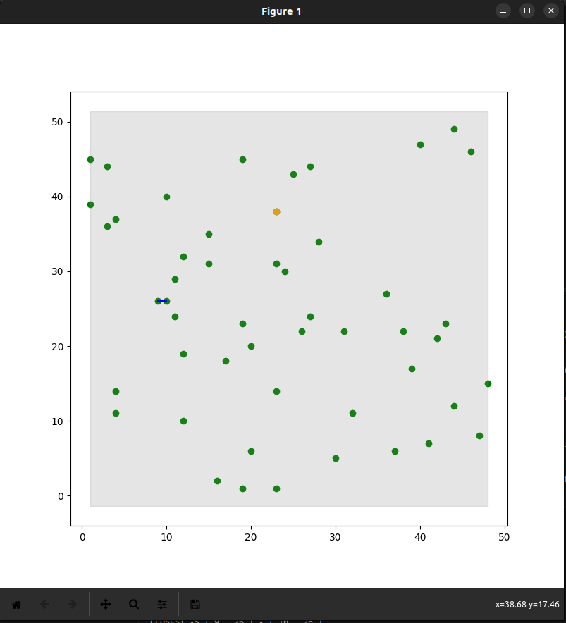
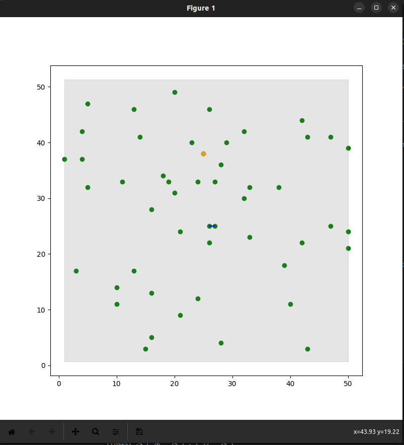
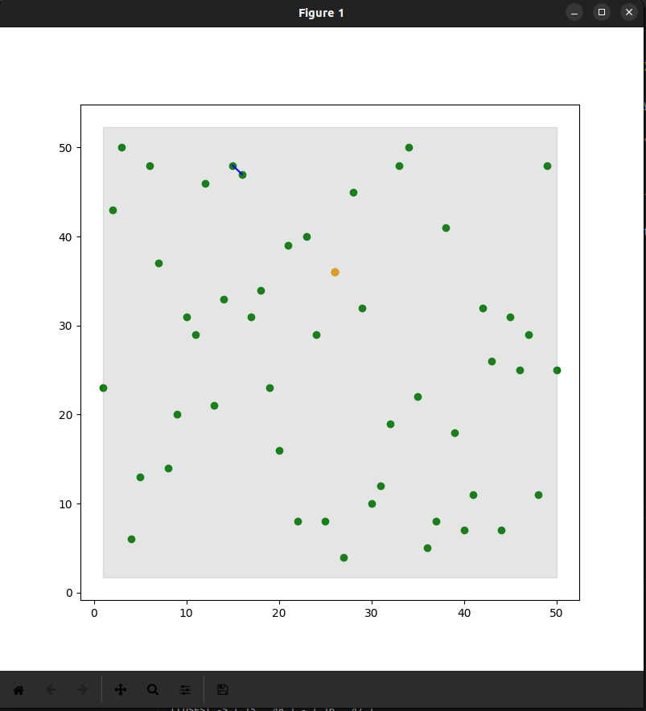

# Closest Points

**Número da Lista**: 4<br>
**Conteúdo da Disciplina**: Dividir e Conquistar<br>

## Alunos
|Matrícula | Aluno |
| -- | -- |
| 20/0013181  | Adne Moretti Moreira |
| 20/0018205  | Gabriel Moretti de Souza |

## Sobre 

O projeto consiste no algoritmo de par de pontos mais próximos utilizando da técnica de dividir e conquistar.
Inicialmente 50 par de números são gerados aleatoriamente e um gráfico é plotado com a ferramenta matplotlib do python, com todos os pontos gerados anteriormente.  A cada passo recursivo que o algoritmo é executaodo o gráfico é atualizado, mostrando de forma visual e dinâmica a maneira que o algoritmo funciona. Isso é importante para o aprendizado do funcionamento do algoritmo, sendo assim, o projeto pode ser utilizado para fins educativos.

Ao final do programa, é apresentado o par de pontos mais próximo que foi encontrado. 

## Vídeo

O vídeo se encontra no diretório principal desse repositório, em formato ".mp4".

## Screenshots







## Instalação 
**Linguagem**: Python<br>
**Framework**: - <br>

Para iniciar, será necessário instalar em sua máquina ```python3```, e, dentro do python, utilizando o comando ```pip install matplotlib``` para instalação, será necessária também a biblioteca matplotlib para criar e manipular o gráfico demonstrado. Com isso, será possível executar o código utilizando o comando:

```
python closest_points.py
```

ou

```
python3 closest_points.py
```

## Uso 

Após o programa ser executado, ele irá disponibilizar ao usuário uma visualização de todo o processo da técnica de par de pontos mais próximos do dividir e conquistar. Nesse momento, o usuário deverá observar e esperar o processo acabar. No terminal, também estará sendo descrito todo o processo, detalhando cada passo, os pares sendo trabalhados, etc.

Ao terminar, o processo estará demonstrando o par de pontos mais próximos com uma linha azul entre eles, demonstrando assim o resultado do programa, ou seja, o par de pontos mais próximos dentre todos. O programa estará então aguardado um input do usuário no console, para apenas finalizar o programa.

